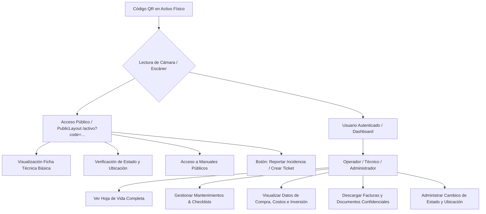
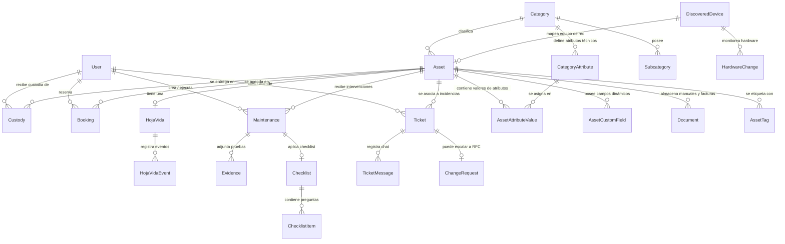

# Análisis Completo de EGAN-TecMan: Arquitectura, Resiliencia y Comparación Competitiva

Este documento presenta un análisis técnico y funcional exhaustivo de **EGAN-TecMan**, una plataforma integral diseñada para el control total del ciclo de vida de los activos físicos corporativos combinada con capacidades avanzadas de soporte técnico (ITSM/Mesa de ayuda). 

Adicionalmente, se incluye una guía detallada para asegurar la resiliencia del software y una comparativa competitiva contra los estándares de la industria: **GLPI**, **Snipe-IT** y **Freshdesk / Freshservice**.

---

## 1. Arquitectura y Pilares Funcionales de EGAN-TecMan

EGAN-TecMan está estructurado sobre una base tecnológica moderna de alto rendimiento:
*   **Backend**: NestJS (TypeScript) + Prisma ORM + Base de datos relacional (MySQL).
*   **Frontend**: Next.js (React + TypeScript) + TailwindCSS + Shadcn/ui para una experiencia premium y responsiva.

A continuación se analizan en detalle los 6 pilares de la aplicación definidos en su esquema de datos y componentes UI:

### Pilar A: Seguimiento de Activos Físicos (Physical Asset Tracking)
El modelo `Asset` en la base de datos es el núcleo de la plataforma. Registra y centraliza todas las propiedades de un activo físico corporativo:
*   **Identificación Única**: Código autogenerado u operacional (`code`) y un identificador UUID asociado al código QR (`qrCode`).
*   **Datos Generales**: Nombre, descripción, marca, modelo, número de serie corporativo y notas internas.
*   **Mapeo de Estructura Organizacional**:
    *   **Categoría y Subcategoría**: Estructura de árbol que permite agrupar activos (ej: *Tecnología -> Laptops*).
    *   **Ubicación (`Location`)**: Jerarquía completa que detalla el sitio geográfico, dirección, piso y sala o cubículo exacto.
    *   **Proveedor (`Supplier`)**: Historial de compra, datos de contacto del distribuidor y enlaces a sitios web de soporte.
*   **Monitoreo del Estado (`AssetStatus`)**: Transiciones dinámicas controladas entre estados críticos de operación:
    *   `ACTIVE` (En uso o disponible)
    *   `MAINTENANCE` (En taller o revisión técnica)
    *   `INACTIVE` (Fuera de uso temporal)
    *   `DISPOSED` (Dado de baja / Chatarrizado)
    *   `RESERVED` (Asignado a reserva o préstamo)
*   **Depreciación y Métricas Financieras**:
    *   El sistema cuenta con un motor de depreciación lineal integrado en el backend (`assets.service.ts`).
    *   Calcula el valor actual del activo en tiempo real cruzando el `acquisitionCost`, la `acquisitionDate` y la vida útil estimada (`expectedLifeCycle` en meses), determinando de forma automática si un activo se encuentra totalmente depreciado y su valor actual neto.

### Pilar B: Características Personalizables (Customizable Attributes)
Para evitar la rigidez de las bases de datos tradicionales, TecMan implementa un sistema híbrido de extensibilidad de datos extremadamente potente:
1.  **Atributos Dinámicos por Categoría (`CategoryAttribute` & `AssetAttributeValue`)**:
    *   Las categorías pueden definir sus propias características técnicas requeridas (ej: *Laptops* requiere "RAM (GB)", "Almacenamiento (GB)" y "Procesador"; *Vehículos* requiere "Cilindrada (cc)" y "Placa").
    *   Soporta tipos estrictos de datos mediante el enum `FieldType`: `TEXT`, `NUMBER`, `SELECT` (con opciones JSON), `CHECKBOX`, `DATE`, `PHOTO`, etc.
    *   Se valida la obligatoriedad (`required`) y unidades de medida (`unit`).
2.  **Campos Personalizados Genéricos (`AssetCustomField`)**:
    *   Pares de clave-valor (`name`, `value`) guardados de manera independiente para almacenar datos únicos de un activo individual que no se aplican necesariamente a toda la categoría.

### Pilar C: Manuales y Gestión Documental (`Document`)
La gestión documental de TecMan mitiga la pérdida de información clave mediante el modelo `Document`:
*   **Tipificación**: Clasificación estricta usando el enum `DocumentType` (`MANUAL`, `CERTIFICATE`, `WARRANTY`, `INVOICE`, `TECHNICAL_SHEET`, `OTHER`).
*   **Control de Versiones**: Cada documento soporta un historial completo de cambios a través de relaciones reflexivas autoreferenciadas (`previousVersionId` y `nextVersions`), permitiendo rastrear el histórico del manual de un equipo conforme este es actualizado.
*   **Asociación de Metadatos**: Almacenamiento seguro del tamaño del archivo (`size`), tipo MIME (`mimeType`), ruta física del servidor y extensión original.

### Pilar E: Hoja de Vida y Trazabilidad Total (`HojaVida` & `HojaVidaEvent`)
Cada activo físico posee una hoja de vida única generada automáticamente al registrarse en la plataforma:
*   **Auditoría y Trazabilidad**: El backend intercepta cambios críticos y genera de manera automatizada registros de eventos (`HojaVidaEvent`) bajo tipos específicos (`CREATED`, `STATUS_CHANGE`, `LOCATION_CHANGE`, `MAINTENANCE`, `FAILURE`, `DOCUMENT_ADDED`, `AUDIT`).
*   **Persistencia de Estado Anterior**: Las transiciones de estado y ubicación no solo se guardan como texto; el backend serializa en formato JSON un registro exacto del cambio (ej: `{"from": "ACTIVE", "to": "MAINTENANCE"}` o `{"from": "LocationA", "to": "LocationB"}`), asegurando que el histórico sea analizable mediante algoritmos en el futuro.

### Pilar F: Seguimiento y Mantenimientos (`Maintenance`)
El control de la salud operativa de los activos es gestionado a través de órdenes de trabajo robustas:
*   **Flujo de Mantenimiento**: Registro de prioridades (`LOW`, `MEDIUM`, `HIGH`, `CRITICAL`), estados de avance (`PENDING`, `SCHEDULED`, `IN_PROGRESS`, `COMPLETED`, `CANCELLED`) y tiempos de ejecución (`scheduledDate`, `startedAt`, `completedAt`).
*   **Métricas de Uso**: Registro del uso acumulado en el momento exacto del mantenimiento (`usageHoursAtMaint` y `usageCyclesAtMaint`), ideal para calcular fallas promedio y frecuencias preventivas.
*   **Lista de Chequeo Dinámica (`Checklist` & `ChecklistItem`)**: El técnico debe completar un formulario digital de validación al realizar las tareas, cuyas respuestas quedan consolidadas en el campo de base de datos `checklistData` en formato de texto enriquecido / JSON.
*   **Evidencias (`Evidence`)**: Adjunto directo de fotos, videos, documentos complementarios o firmas digitales del técnico y el cliente, con un fuerte control de eliminación en cascada para evitar archivos huérfanos.
*   **Mesa de Ayuda Integrada (`Ticket`)**: Permite enlazar incidencias de soporte directamente con el activo físico afectado, cerrando la brecha entre el reporte del usuario final y la intervención técnica.

### Pilar G: Acceso Público por Código QR e Interacción por Roles
La interacción del usuario final está optimizada en función de sus privilegios utilizando una arquitectura segura:



1.  **Vista Pública (`/activo/page.tsx`)**:
    *   Ruta totalmente liberada de la autenticación mediante el decorador `@Public()` en el backend.
    *   Diseñada con enfoque *mobile-first*, permitiendo a cualquier empleado o cliente escanear el QR y visualizar instantáneamente la información general del equipo, su ubicación y atributos dinámicos sin requerir login previa.
2.  **Vista Administrativa/Técnica (`/dashboard/assets/[id]`)**:
    *   Exclusiva para personal autenticado.
    *   Despliega paneles avanzados con la depreciación contable calculada, bitácora de eventos históricos de la Hoja de Vida, listados y estados de los tickets de soporte del activo, manuales restringidos de uso interno y auditoría de custodias pasadas (`Custody` y `Booking`).

---

## 2. Relaciones del Modelo de Datos (Prisma Schema Map)

El siguiente diagrama ilustra las relaciones del modelo de datos de EGAN-TecMan, demostrando cómo se conecta el seguimiento físico, las características configurables, los mantenimientos, la gestión documental, los tickets y el módulo de seguridad:



---

## 3. Estrategia de Resiliencia del Software: Que la App no se Rompa

Para asegurar que EGAN-TecMan opere de manera continua sin fallas críticas, es imperativo establecer las siguientes salvaguardas en las interacciones y flujos del sistema:

### A. Gestión de Fechas e Inconsistencias de Zona Horaria (Timezone Shifts)
> [!WARNING]
> Un error clásico en sistemas web es que las fechas disminuyan un día al guardarse debido a discrepancias entre la zona horaria del cliente (es-CO / UTC-5) y el almacenamiento en base de datos en UTC.
*   **Solución en TecMan**: El backend implementa un sanitizador de fechas estricto (`sanitizeDates` y `toDateTime` en `assets.service.ts`). Si el frontend envía una fecha simple como `YYYY-MM-DD`, el backend le concatena `T00:00:00.000Z` antes de entregarla a Prisma. Esto bloquea cualquier desfase regresivo.
*   **Acción Recomendada**: Mantener siempre el parseo manual centralizado en el backend y forzar el uso del componente `Calendar` o `<input type="date">` con formatos ISO unificados.

### B. Manejo Resiliente de Nulos (Null-Safety) en UI
*   Los activos pueden no tener subcategoría (`subcategoryId?`), proveedor (`supplierId?`), serial o costos registrados.
*   **Solución en TecMan**: En la vista de detalle del activo (`_client.tsx`), la visualización de filas utiliza la función protectora `InfoRow` que evalúa explícitamente:
    ```typescript
    if (!value && value !== 0) return null;
    ```
    Y en el despliegue de grids, se aplican técnicas de filtrado de elementos booleanos:
    ```typescript
    [asset.brand, asset.model].filter(Boolean).join(" · ")
    ```
*   **Acción Recomendada**: Nunca renderizar propiedades anidadas directamente (ej: `{asset.supplier.name}`) sin encadenamiento opcional (ej: `{asset.supplier?.name}`). De lo contrario, si el campo es nulo, React arrojará un error de renderizado en blanco que romperá la pantalla completa.

### C. Consistencia en Atributos Dinámicos
*   Al cambiar la categoría de un activo durante su edición, los atributos técnicos del formulario deben mutar de forma segura.
*   **Solución en TecMan**: El frontend resetea explícitamente los valores de atributos cuando se detecta un cambio en la categoría seleccionada:
    ```typescript
    onChange={e => { f("categoryId", e.target.value); f("subcategoryId", ""); setAttrValues({}) }}
    ```
    Esto evita que se envíen datos de características incompatibles (ej: guardar valores de RAM en un activo categoría Extintor).

### D. Control de Carga de Archivos e Importación Masiva (`assets.service.ts`)
*   La importación desde plantillas XLSX procesa filas de forma secuencial. Una fila corrupta no debe botar el servidor backend.
*   **Solución en TecMan**: El método `importFromRows` encapsula cada fila en un bloque `try-catch` individual. Si una fila falla (ej: categoría inexistente, código duplicado o formato de fecha inválido), el error es capturado, se añade al log de fallas y la ejecución continúa de manera segura procesando el resto del archivo:
    ```typescript
    try {
      // Proceso de creación individual del activo...
      results.created++
    } catch (e: any) {
      results.errors.push(`Fila ${i + 2}: ${e.message}`)
    }
    ```

---

## 4. EGAN-TecMan vs. Alternativas del Mercado

La siguiente tabla compara de manera objetiva las capacidades de **EGAN-TecMan** contra las tres herramientas más utilizadas a nivel global: **Snipe-IT** (Líder en inventarios), **GLPI** (Estándar de ITSM libre) y **Freshdesk/Freshservice** (Líder SaaS de mesa de ayuda empresarial).

| Dimensión de Comparación | Snipe-IT | GLPI | Freshservice (Freshworks) | EGAN-TecMan |
| :--- | :--- | :--- | :--- | :--- |
| **Enfoque Principal** | Control estricto de inventarios de hardware y licencias. | Mesa de ayuda completa y base de datos de configuración (CMDB). | ITSM / ITAM unificado en la nube para empresas medianas y grandes. | **Ciclo de vida de activos físicos corporativos + Mesa de ayuda integrada (ITIL).** |
| **Características Personalizables** | Campos dinámicos agrupables por plantillas, de configuración estática. | Campos personalizables rígidos, requiere plugins complejos para expandirse. | Altamente personalizable con formularios en la nube, costo adicional por módulo. | **Atributos técnicos dinámicos con herencia directa por categoría y validación estricta de tipos de datos.** |
| **Gestión Documental e Historial** | Básico: Carga de archivos estáticos y visualización de logs simples. | Robusto: Base de conocimiento y gestor documental complejo pero con interfaz antigua. | Premium: Repositorio integrado de manuales, contratos y convenios de soporte. | **Historial inteligente auto-actualizable por eventos (Hoja de Vida), control de versiones de manuales y adjuntos de evidencias.** |
| **Trazabilidad y Mantenimiento** | Muy limitado. No posee módulo formal de órdenes de trabajo o checklists. | Completo pero complejo. Planificación de tareas pesada para el técnico de campo. | Excelente. Automatización de tareas, pero requiere licenciamiento costoso de campo. | **Módulo especializado de mantenimiento preventivo/correctivo, firma digital y checklists dinámicos integrados.** |
| **Acceso Móvil / QR** | Generación de etiquetas y búsqueda en app móvil básica. | Requiere plugins o apps de terceros para lectura de QR nativa limpia. | Integrado en app nativa premium, muy eficiente pero privada bajo licencia. | **Página pública de lectura QR (mobile-first) con visualización selectiva para usuarios externos y atajo directo a soporte.** |
| **Soporte ITSM / Helpdesk** | Inexistente. Requiere integraciones externas para gestionar tickets. | Excelente: Sistema de incidentes, problemas, cambios e ITIL de forma nativa. | Premium: Herramientas líderes en la industria de soporte al empleado y automatizaciones. | **Módulo nativo de Tickets, Catálogo de Servicios, cumplimiento de SLAs y escalado a solicitudes de cambio (RFC).** |
| **Curva de Aprendizaje y UX** | Baja (Interfaz limpia y fácil de entender). | Alta (Interfaz densa, terminología compleja y diseño anticuado). | Baja (Experiencia de usuario fluida y moderna). | **Muy Baja (Diseño limpio basado en Tailwind, minimalista e intuitivo para cualquier rol).** |
| **Esquema de Costos** | Open Source (Gratis auto-hospedado) o SaaS comercial. | Open Source (Gratis auto-hospedado) o Red de soporte de pago. | SaaS basado en suscripción mensual obligatoria por agente técnico (Costoso). | **Hospedaje propio sin límites de licencias, adaptado a la infraestructura del cliente sin pagos recurrentes.** |

---

## 5. Conclusión y Recomendación Estratégica

**EGAN-TecMan** se posiciona como una **solución híbrida de alto valor** que resuelve las limitaciones clave de sus competidores:
1.  **Supera a Snipe-IT** al integrar de manera nativa la gestión de mantenimientos, check-lists con firmas, y soporte mediante tickets (ITSM), permitiendo no solo saber *dónde* está un equipo, sino *cómo opera* y *cuántas veces ha fallado*.
2.  **Supera a GLPI** al ofrecer una interfaz de usuario limpia, moderna, y de carga rápida (UX excepcional), eliminando la complejidad excesiva de configuración que suele abrumar al personal técnico y operativo.
3.  **Representa una alternativa costo-beneficio inmejorable frente a Freshservice**, entregando los componentes críticos de descubrimiento de red, catálogos de servicios, control contable y alertas preventivas en una plataforma de código propio sin cobros mensuales por técnico.

Su arquitectura de base de datos relacional y las salvaguardas implementadas a nivel de código (manejo resiliente de zonas horarias, try-catch en importación masiva y renderizado inmune a nulos) garantizan que la aplicación sea **robusta, escalable y tolerante a fallos operativos comunes**.
