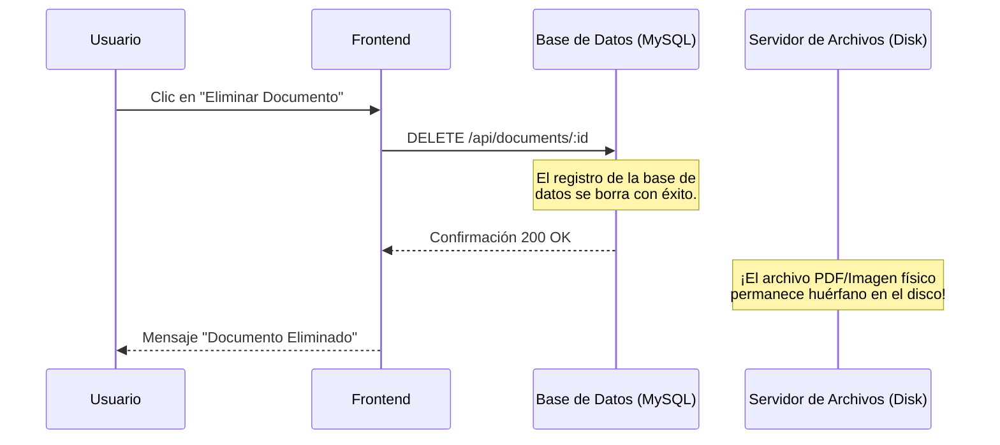

# Análisis de Fallas Críticas, Pérdida de Datos y Seguridad en EGAN-TecMan

Este documento detalla una auditoría técnica profunda del flujo de datos, relaciones de base de datos, controladores NestJS y pantallas frontend de **EGAN-TecMan**. Se identificaron fallas críticas de pérdida silenciosa de datos, fugas de almacenamiento físico en disco, vulnerabilidades de denegación de servicio (DoS) y brechas en la seguridad de roles.

---

## 1. Pérdida Silenciosa de Datos (Data Stripping) en Controladores NestJS

El backend de TecMan implementa la tubería de validación global `ValidationPipe` en [main.ts](file:///c:/egan_projects/egan-tecman/backend/src/main.ts#L13-L20) con la propiedad de seguridad activa `whitelist: true`:

```typescript
app.useGlobalPipes(
  new ValidationPipe({
    whitelist: true,
    transform: true,
    forbidNonWhitelisted: false,
  }),
)
```

> [!CAUTION]
> **whitelist: true** elimina automáticamente cualquier campo del cuerpo de la petición HTTP (`request.body`) que no esté explícitamente declarado con decoradores en el DTO (Data Transfer Object) correspondiente.
> Esto ha provocado dos fallas gravísimas de **pérdida silenciosa de datos**:

### Fallo A: Las Características Personalizables (`attributeValues`) nunca se guardan
*   **En el Frontend**: En [page.tsx](file:///c:/egan_projects/egan-tecman/frontend/src/app/dashboard/assets/page.tsx#L137-L140), el formulario reúne las características técnicas dinámicas editadas por el usuario y las envía en el payload como `attributeValues` (un arreglo de objetos `{ attributeId, value }`):
    ```typescript
    attributeValues: Object.entries(attrValues)
      .filter(([, v]) => v !== "")
      .map(([attributeId, value]) => ({ attributeId, value }))
    ```
*   **En el Backend**: El controlador de activos [assets.controller.ts](file:///c:/egan_projects/egan-tecman/backend/src/modules/assets/assets.controller.ts#L17-L21) recibe la petición y la valida contra el DTO `CreateAssetDto`:
    ```typescript
    create(@Body() dto: CreateAssetDto)
    ```
*   **La Falla**: Al revisar [create-asset.dto.ts](file:///c:/egan_projects/egan-tecman/backend/src/modules/assets/dto/create-asset.dto.ts), se observa que **el campo `attributeValues` no está definido en el DTO**.
*   **Consecuencia**: La tubería `whitelist: true` **remueve silenciosamente el arreglo `attributeValues`** antes de que llegue a `AssetsService`. Por lo tanto, el sistema nunca guarda ni actualiza los atributos técnicos dinámicos de los activos. La base de datos siempre queda vacía en ese campo.

### Fallo B: Las Respuestas de Listas de Chequeo (`checklistData`) se pierden al completar mantenimientos
*   **En el Frontend**: Al completar un mantenimiento con checklist, las respuestas se envían en el cuerpo de la petición.
*   **En el Backend**: El controlador [maintenance.controller.ts](file:///c:/egan_projects/egan-tecman/backend/src/modules/maintenance/maintenance.controller.ts#L53-L57) procesa la finalización usando `CompleteMaintenanceDto`:
    ```typescript
    complete(@Param("id") id: string, @Body() dto: CompleteMaintenanceDto)
    ```
*   **La Falla**: En [complete-maintenance.dto.ts](file:///c:/egan_projects/egan-tecman/backend/src/modules/maintenance/dto/complete-maintenance.dto.ts), solo están declarados `diagnosis`, `solution` y `cost`. **El campo `checklistData` está ausente**.
*   **Consecuencia**: Las respuestas de seguridad del checklist completadas por el técnico son **purgadas silenciosamente**. Las bitácoras de mantenimiento se cierran pero con el campo de checklist vacío en la base de datos, perdiendo la evidencia de las inspecciones de seguridad física.

---

## 2. Fugas de Almacenamiento Físico en Disco (Orphaned Files Leak)

El módulo de almacenamiento de archivos de TecMan utiliza almacenamiento local en el servidor a través de [storage.service.ts](file:///c:/egan_projects/egan-tecman/backend/src/modules/storage/storage.service.ts). Sin embargo, carece de mecanismos de sincronización en eliminaciones.



### Falla A: Fuga de Archivos al Eliminar Documentos
*   En [documents.service.ts](file:///c:/egan_projects/egan-tecman/backend/src/modules/documents/documents.service.ts#L19-L21), el método de eliminación ejecuta únicamente:
    ```typescript
    async remove(id: string) {
        return this.prisma.document.delete({ where: { id } });
    }
    ```
*   **La Falla**: No existe llamada a `StorageService.deleteFile(filename)`. 
*   **Consecuencia**: Cada vez que un usuario elimina una factura, manual técnico o certificado de garantía antiguo, el registro de la DB desaparece pero **el archivo físico queda abandonado para siempre en la carpeta `/uploads` del disco**. Esto creará un consumo de almacenamiento desmedido e irreversible (Disk Space Exhaustion Leak).

### Falla B: Evidencias de Mantenimiento Huérfanas
*   En la base de datos, el modelo `Evidence` está conectado a `Maintenance` con borrado en cascada:
    ```prisma
    model Evidence {
      ...
      maintenance   Maintenance  @relation(fields: [maintenanceId], references: [id], onDelete: Cascade)
    ```
*   **La Falla**: Cuando se elimina una orden de mantenimiento, Prisma borra en cascada las filas de la tabla `evidence`. Sin embargo, esto es a nivel de base de datos SQL. **Los archivos de fotos, firmas y videos físicos adjuntos en el servidor de archivos nunca son eliminados del disco**.

---

## 3. Vulnerabilidades en Carga de Archivos (Upload Vulnerabilities)

El endpoint `POST /api/storage/upload` expone al servidor a fallos catastróficos de infraestructura debido a la falta de restricciones técnicas:

### Falla A: Caída del Servidor por Desbordamiento de Memoria (OOM DoS)
*   En [storage.controller.ts](file:///c:/egan_projects/egan-tecman/backend/src/modules/storage/storage.controller.ts#L15), el interceptor `FileInterceptor('file')` almacena por defecto todo el archivo en la memoria RAM antes de escribirlo en disco a través del búfer:
    ```typescript
    await fs.promises.writeFile(filePath, file.buffer);
    ```
*   **La Falla**: No hay límite de tamaño configurado a nivel de Multer (ej. `limits: { fileSize: 10 * 1024 * 1024 }`).
*   **Consecuencia**: Si un usuario o atacante carga un archivo de gran tamaño (ej: un video de 3 GB o un manual malicioso de alta resolución), el servidor NestJS intentará alojar el búfer completo en memoria RAM, desencadenando un error de **Out-of-Memory (OOM)**. Node.js abortará el proceso inmediatamente, **tumbará la aplicación completa** para todos los usuarios y requerirá un reinicio manual del servicio.

---

## 4. Brechas de Seguridad en Roles y Control de Acceso

La gestión de seguridad se basa en la combinación de `JwtAuthGuard` y `RolesGuard` a nivel global en [app.module.ts](file:///c:/egan_projects/egan-tecman/backend/src/app.module.ts#L100-L110). Sin embargo, la lógica de validación interna presenta una vulnerabilidad de diseño:

### Falla A: Permisos Inactivos en Base de Datos (Dormant Permissions)
*   El modelo `Role` en el esquema Prisma cuenta con un campo `permissions String @db.LongText`, diseñado idealmente para un control granular (ej: `["assets:create", "maintenance:complete"]`).
*   **La Falla**: En [roles.guard.ts](file:///c:/egan_projects/egan-tecman/backend/src/common/guards/roles.guard.ts#L25-L31), el guard ignora por completo la columna `permissions` y realiza una validación basándose únicamente en cadenas de texto **hardcodeadas de los nombres de los roles**:
    ```typescript
    const hasRole = () => requiredRoles.some((role) => user.role.name === role);
    if (hasRole() || user.role.name === 'Administrador' || user.role.name === 'Superadministrador Egan') {
        return true;
    }
    ```
*   **Consecuencia**:
    1.  Si un administrador de TI ajusta los privilegios de un rol dentro del panel de administración (AdminJS), dichos cambios **no tienen ningún efecto operacional**, creando una falsa sensación de control de seguridad.
    2.  Si por razones de branding u organización se decide renombrar el rol "Administrador" a "Administrador de TI" desde la base de datos, **todos los administradores perderán de forma inmediata el acceso a todas las rutas protegidas**, ya que el guard busca una coincidencia exacta de texto estático (`'Administrador'`).

---

## 5. Excepciones no Controladas y Bloqueos en Eliminación de Activos

El flujo de borrado de activos expone directamente la infraestructura a fallos de transacción:

### Falla A: Ruptura por Restricciones de Clave Foránea (Unhandled DB Exceptions)
*   En el esquema Prisma, las relaciones de `Asset` con entidades operacionales críticas como `Maintenance`, `Ticket`, `Custody` o `Booking` no definen una política de borrado (`onDelete: Cascade` u `onDelete: SetNull`). Esto significa que MySQL aplica la restricción por defecto **RESTRICT** para resguardar la integridad de los datos.
*   **La Falla**: En [assets.service.ts](file:///c:/egan_projects/egan-tecman/backend/src/modules/assets/assets.service.ts#L178-L181), el borrado se ejecuta sin control de transacciones ni interceptores específicos de restricción:
    ```typescript
    async remove(id: string) {
      await this.findOne(id)
      return this.prisma.asset.delete({ where: { id } })
    }
    ```
*   **Consecuencia**: Si un activo tiene al menos un ticket, orden de mantenimiento o historial de custodia asignado, intentar eliminarlo arrojará una excepción de base de datos Prisma `P2003` (Foreign key constraint failed). Al no estar encapsulado adecuadamente, NestJS devolverá un error genérico `500 Internal Server Error`, exponiendo logs internos y degradando la confiabilidad percibida por el usuario.
